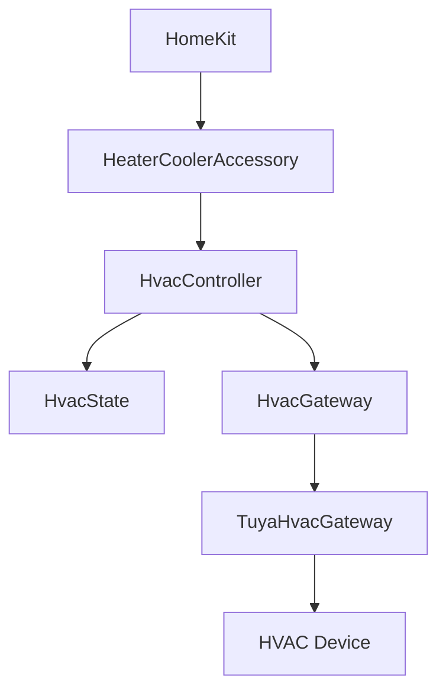
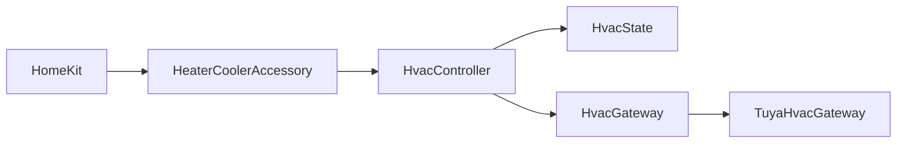

# Architecture

> **Project:** Homebridge Tuya HVAC
>
> **Status:** Reference documentation
>
> This document defines the reference architecture of the project.
>
> It is the single source of truth regarding the software architecture. Any significant architectural change must be reflected in this document.

---

# Objectives

The project aims to provide a Homebridge plugin for Tuya-compatible HVAC devices that is:

- Local-first (LAN communication only)
- Independent from the Tuya Cloud during normal operation
- Modular
- Testable
- Maintainable
- Extensible

Although the first supported device is an **IVW Inverter 10 swimming pool heat pump**, the architecture is intentionally designed to support additional Tuya-compatible HVAC devices over time.

---

# Architectural Principles

The project follows a number of fundamental principles.

## Separation of concerns

Each component has a single responsibility.

Business logic must never depend on Homebridge, HomeKit or Tuya.

---

## Domain-first

The business domain is the heart of the application.

External technologies are considered implementation details.

---

## Infrastructure isolation

The Tuya protocol is isolated behind an abstraction.

Changing the communication layer must not impact the business logic.

---

## Local-first

The plugin communicates directly with the device over the local network.

The Tuya Cloud is only used during installation or debugging.

---

# Overall Architecture



---

# Layers

## HomeKit

Represents Apple's HomeKit ecosystem.

Responsibilities:

- user interface
- characteristics
- automations

The HomeKit layer contains no business logic.

---

## HeaterCoolerAccessory

Adapter between HomeKit and the business domain.

Responsibilities:

- expose HomeKit characteristics
- receive HomeKit requests
- translate HomeKit interactions into business operations
- reflect the current HVAC state

The accessory never communicates directly with Tuya.

---

## HvacController

Core business component.

Responsibilities:

- coordinate operations
- apply business rules
- maintain consistency
- orchestrate communication with the gateway

The controller never manipulates Tuya Data Points.

---

## HvacState

Represents the current state of the HVAC device.

Example:

```ts
interface HvacState {
  active: boolean;

  currentTemperature: number;

  targetTemperature: number;

  mode: HvacMode;
}
```

Every layer manipulates this object instead of raw Data Points.

---

## HvacGateway

Business interface used by the controller.

Example:

```ts
interface HvacGateway {
  getState(): Promise<HvacState>;
  setActive(active: boolean): Promise<HvacState>;
  setMode(mode: HvacMode): Promise<HvacState>;
}
```

The business layer depends only on this interface.

---

## TuyaHvacGateway

Concrete implementation of `HvacGateway`.

Responsibilities:

- communicate with Tuya devices
- map Data Points
- encode and decode Tuya messages
- handle protocol versions

This is the only layer allowed to know:

- Data Points
- Local Keys
- Tuya protocol versions
- protocol-specific values

---

## HVAC Device

Physical equipment.

Examples:

- swimming pool heat pump
- residential heat pump
- air conditioning system

The first supported device is the **IVW Inverter 10**.

---

# Dependency Rules

Allowed dependencies:



Reverse dependencies are forbidden.

The business domain must never depend on infrastructure.

---

# Development Rules

The following rules are mandatory.

- Homebridge never manipulates Data Points.
- Business logic belongs exclusively to `HvacController`.
- Tuya-specific concepts are confined to `TuyaHvacGateway`.
- The domain layer must remain independent from Tuya.
- Significant architectural decisions must be documented in `ADR.md`.
- Successful commands return a complete state confirmed by the device.

---

# Extensibility

The architecture is designed to support:

- multiple HVAC device models;
- multiple Tuya protocol versions;
- alternative communication backends;
- additional HomeKit capabilities;
- future integrations beyond Homebridge.

New communication protocols should only require a new implementation of `HvacGateway`.

---

# Related Documentation

- [ADR index](../adr/ADR.md)
- [HomeKit mapping](homekit.md)
- [Tuya reference](../tuya/)
- [Contributing](../CONTRIBUTING.md)
- [Roadmap](../development/roadmap.md)
