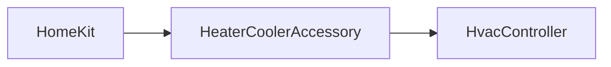

# HomeKit

> **Project:** Homebridge Tuya HVAC
>
> **Status:** Reference documentation
>
> This document describes how the business domain is exposed through HomeKit.
>
> It documents the project's HomeKit integration strategy rather than HomeKit itself.

---

# Objectives

The primary objective is to provide a HomeKit experience that feels natural to users while remaining faithful to the capabilities of the underlying HVAC device.

The HomeKit layer must never expose protocol-specific concepts such as Tuya Data Points.

---

# Design Principles

The HomeKit integration follows these principles:

- HomeKit represents user intentions.
- Business logic belongs to the domain layer.
- Tuya-specific concepts remain hidden.
- HomeKit limitations must not leak into the business domain.

---

# HomeKit Service

The project exposes a single HomeKit service:

```
HeaterCooler
```

This choice is documented in `ADR.md`.

---

# Why HeaterCooler?

Two HomeKit services were evaluated:

- Thermostat
- HeaterCooler

The Thermostat service was sufficient for initial experimentation but presents several limitations for reversible HVAC devices.

The HeaterCooler service provides:

- native ON/OFF handling;
- dedicated heating and cooling modes;
- better representation in the Home application.

It therefore became the reference service for the project.

---

# Layer Responsibilities



## HomeKit

Responsible for:

- User interface
- Automations
- Scenes
- Siri

---

## HeaterCoolerAccessory

Responsible for:

- translating HomeKit requests into business operations;
- exposing the current HVAC state;
- synchronizing HomeKit with the controller.

It contains no business logic.

---

## HvacController

Responsible for:

- interpreting user intentions;
- applying business rules;
- communicating with the HVAC gateway.

---

# HomeKit Characteristics

The following characteristics are used.

| Characteristic              | Purpose                      |
| --------------------------- | ---------------------------- |
| Active                      | Turn device ON/OFF           |
| CurrentTemperature          | Current measured temperature |
| HeatingThresholdTemperature | Heating setpoint             |
| CoolingThresholdTemperature | Cooling setpoint             |
| CurrentHeaterCoolerState    | Current operating state      |
| TargetHeaterCoolerState     | Requested operating mode     |

---

# Characteristics Not Used

The following HomeKit characteristics are intentionally ignored during the initial implementation.

| Characteristic       | Reason                                |
| -------------------- | ------------------------------------- |
| SwingMode            | Not currently supported by the device |
| RotationDirection    | Not applicable                        |
| LockPhysicalControls | No current use case                   |
| RotationSpeed        | Reserved for future evaluation        |

Future versions may expose additional characteristics if they provide real value.

---

# Business Mapping

HomeKit communicates exclusively with the business domain.

Example:

```text
User selects HEAT

↓

HeaterCoolerAccessory

↓

HvacController

↓

HvacMode.HEAT

↓

HvacGateway

↓

TuyaHvacGateway

↓

Tuya Data Point
```

The accessory never manipulates Data Points directly.

---

# Operating Modes

The business domain currently exposes:

| Business Mode | HomeKit |
| ------------- | ------- |
| AUTO          | AUTO    |
| HEAT          | HEAT    |
| COOL          | COOL    |

Power remains independent from mode: `Active=false` does not create an OFF mode.

The Home application presents the inactive accessory as “Éteint”. This label is derived from the native `Active` characteristic; it is not an HVAC mode and is never mapped to DP4.

Real-device validation showed that selecting AUTO, HEAT or COOL in the Home application may also emit an `Active=ON` request, including when the accessory is already active. The adapter treats power and mode as separate operations and serializes their Tuya transactions. This HomeKit presentation behavior does not change the domain model.

Additional vendor-specific modes remain internal to the business layer.

Examples:

- Eco
- Boost
- Silent
- Smart

These may later be exposed through additional HomeKit characteristics if appropriate.

## V1 automatic mode

V1 maps HomeKit `AUTO` directly to the domain `Auto` mode and the Tuya profile value `auto`.

HomeKit exposes separate heating and cooling thresholds in automatic mode. V1 does not implement a two-setpoint control rule: both threshold characteristics reflect the device's single validated target temperature. Double-setpoint behavior requires separate device validation and is outside the current increment.

---

# Temperature

The project currently uses Celsius.

Temperature conversions, if required, belong to the business layer.

---

# Synchronization

The accessory must remain synchronized with the HVAC device.

The controller is responsible for:

- refreshing the current state;
- propagating changes to HomeKit;
- maintaining consistency.

---

# Error Handling

Communication failures must never leave HomeKit in an inconsistent state.

Whenever possible:

- optimistic updates should be avoided;
- the actual device state should become the source of truth after each command.

`applyState()` is the single place that writes a confirmed `HvacState` into HomeKit characteristics. Long Tuya transactions run in the background so HomeKit remains responsive. Rapid requests for the same characteristic are coalesced using the latest user intention.

---

# Future Evolution

Future versions may expose additional HomeKit capabilities, including:

- vendor-specific operating modes;
- energy information;
- defrost status;
- diagnostics.

Such additions must remain consistent with the project's architectural principles.

---

# Related Documentation

- [Architecture](architecture.md)
- [ADR index](../adr/ADR.md)
- [Tuya reference](../tuya/)
